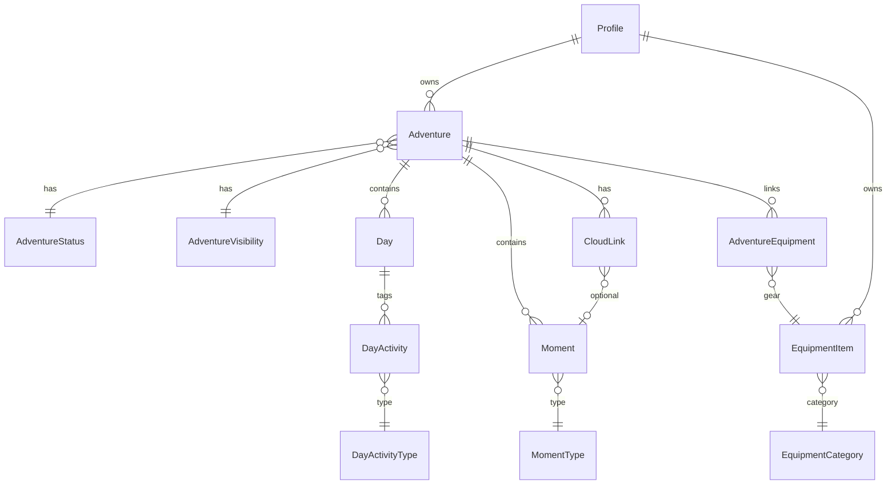

# Domain Model

Memora's domain centers on **one profile** owning **adventures**, each composed of **days** and **moments**, with optional **equipment**, **photos**, and **cloud media** attachments.

> **Naming note:** Backend entities use `Adventure`, `Day`, `Moment`. Frontend TypeScript still uses legacy aliases `Trip`, `TripDay`, `TripEvent` in places — UI copy must say Adventure / Moment per [BRANDING.md](./BRANDING.md).

## Entity relationship diagram

## Entities

### User

**Table:** `users`  
**Why:** Authentication identity (email + password hash). Separated from public-facing profile so credentials can change without affecting portfolio URLs.

| Field | Notes |
|-------|-------|
| id | UUID |
| email | Unique login |
| passwordHash | BCrypt |

### Profile

**Table:** `profiles`  
**Why:** Public persona — username, display name, bio, tagline, avatar, cover. One profile per user. Username drives `/profile/{username}`.

| Field | Notes |
|-------|-------|
| userId | FK → users (1:1) |
| username | Unique, case-insensitive lookup |
| displayName, bio, tagline | Portfolio copy |
| avatarUrl, coverUrl | Image URLs |
| location, website | Optional public meta |

### Adventure

**Table:** `adventures`  
**Why:** The container for a journey — title, dates, country, optional cover, status, visibility. This is what users call a "trip" in conversation.

| Field | Notes |
|-------|-------|
| ownerId | FK → profiles |
| slug | URL segment for public pages |
| coverImageUrl | Optional — object storage URL; gradient placeholder when null |
| statusId | FK → adventure_statuses |
| visibilityId | FK → adventure_visibilities |
| adventureType | String (e.g. `MIXED`) |
| tags | Text array |

Public portfolio shows adventures where visibility = `PUBLIC` and status is not `ARCHIVED`.

### Day (AdventureDay)

**Table:** `days`  
**Why:** Journal structure — one row per calendar day in an adventure. Holds day number, date, title, summary, and activity type chips.

| Field | Notes |
|-------|-------|
| adventureId | FK |
| dayNumber | Order within adventure |
| date | Calendar date |

**DayActivity** (`day_activities`): many-to-many link between a day and `day_activity_types` (hiking, cycling, etc.).

### Moment

**Table:** `moments`  
**Why:** Atomic memory — the primary content unit. A meal, hike segment, photo note, expense, tip, etc.

| Field | Notes |
|-------|-------|
| adventureId, dayId | FKs |
| momentTypeId | FK → moment_types |
| title | Required |
| description | Optional notes |
| photoUrl | Optional — one photo for MVP (object storage URL) |
| startTime, endTime | Optional `LocalTime` |
| sortOrder | Timeline ordering |
| distanceKm, elevationGainM | Optional metrics |
| location | Embedded name, latitude, longitude (optional) |

**Moment types:** includes `PHOTO_VIDEO` for drone footage, action camera, phone video, and camera photos. There is **no** separate `DRONE` moment type.

**Photos (MVP):** one `photoUrl` per moment. Album/gallery support is future roadmap. Legacy mock mode may still use `photoIds` — API mode uses `photoUrl`.

**Cloud links** attach separately for large external video (YouTube, Drive, etc.).

### Location (on Moment)

Not a separate table — location is embedded on `Moment` as optional metadata:

| Field | Notes |
|-------|-------|
| name | Optional human label |
| latitude | Required when location set |
| longitude | Required when location set |

**Why:** A moment happens somewhere specific. UX is map pin selection — not creating a global **Place** catalog entry. Heavy Place workflows are deferred.

### Equipment

**Table:** `equipment_items`  
**Why:** Personal gear inventory — tents, bikes, cameras — **reused across adventures**, not duplicated per trip.

| Field | Notes |
|-------|-------|
| ownerId | FK → profiles |
| categoryId | FK → equipment_categories |
| name, brand, model, notes, active | Inventory fields |
| photoUrl | Optional image URL |

### EquipmentCategory

**Table:** `equipment_categories`  
**Why:** Classify gear. System defaults (`is_default=true`) plus future per-user categories. Includes a `DRONE` **equipment category** — distinct from moment types.

### AdventureEquipment

**Table:** `adventure_equipment`  
**Why:** Join table — which gear was brought on which adventure. Many-to-many link; gear rows are not copied.

Synced via `equipmentIds` on adventure create/update (replace-all on update).

Displayed on private and public adventure pages.

### Participant

**Not yet implemented** as a first-class entity. `participantIds` exist on moment DTOs as placeholders for Phase 4 (Participants). Today moments store empty participant lists.

### CloudLink

**Table:** `cloud_links`  
**Why:** Large media (YouTube, Google Drive, etc.) stays in the cloud — Memora stores URL + provider + title, not multi-GB files.

| Field | Notes |
|-------|-------|
| adventureId | Required parent |
| momentId | Optional attachment to one moment |
| providerId | FK → cloud_link_providers |

### Place

**Table:** `places`  
**Why:** Schema exists for future saved-location features. **Not part of current product UX** — no heavy Place creation flow. Places nav section is unfinished (Soon badge).

### ReferenceData

Not one entity — see [REFERENCE_DATA.md](./REFERENCE_DATA.md). Lookup tables: statuses, visibilities, moment types, day activity types, equipment categories, cloud providers, place categories.

## Media storage (cross-cutting)

Uploaded images flow through `MediaStorageService` → public URL stored on `adventures.cover_image_url` or `moments.photo_url`. Storage key tracked in upload response; entity stores URL only.

## Base entity audit fields

All domain entities extend `BaseEntity`:

- `id` (UUID, generated)
- `createdAt`, `updatedAt` (instant, UTC)
- `createdBy`, `updatedBy` (UUID, JPA auditing)

Reference tables use similar audit columns after migration V7.

## Ownership rules

- A profile owns adventures and equipment
- All mutations verify the current user's profile matches `ownerId`
- Public reads use `PublicPortfolioService` with visibility/status filters — no auth required
- Public adventure detail includes moments (with `photoUrl`), equipment, cloud links, days

## Related docs

- [REFERENCE_DATA.md](./REFERENCE_DATA.md)
- [DATABASE.md](./DATABASE.md)
- [API_GUIDELINES.md](./API_GUIDELINES.md)
